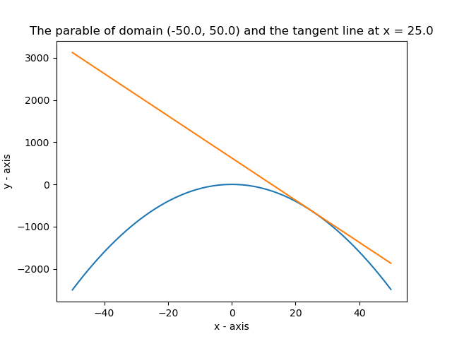

# Quadratic function derivative calculator.

## Calculate the derivative of a quadratic function at any given point.

Note: this project is under development, soon i'll add more information in this readme.

The idea here is to create a quadratic function derivative calculator, where you can choose the function domain and a point where you want to know the derivative. The code also need to create a file with a explanation about how derivatives work and a log of the calculated derivative.
